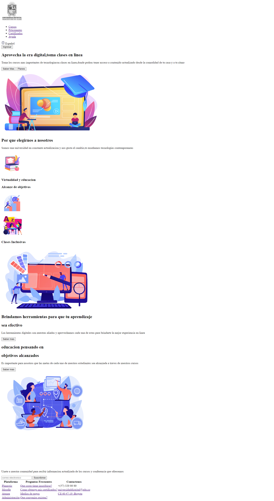

<h1>Taller 9: daniela guzman perez</h1>

<h2>Informacion</h2>

Curso: Full Stack Básico - Grupo 1

Profesor: Cristian Patiño

<h2>Punto 1: Link de figma</h2>
<a href="https://www.figma.com/file/C2fsPjxjtzU7oRbX842YFe/Untitled?type=design&node-id=0-1&t=cDyExbho3E7hcu3t-0">Link de Figma</a> 

<h2>Punto 2: HTML</h2>

